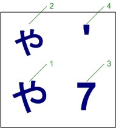

# Summary

A typewriter is a device that has keys connected to metal bars with imprints of letters on them. As the typist strikes these keys, they push the desired bar upward to let it strike an ink ribbon, which then prints a character onto a piece of paper behind it.

While typewriters are now largely obsolete, industries such as law, accounting, and government jobs still demand them to an extent. The mechanical nature of a typewriter makes it extremely secure, and it makes creating documents easy, with minimal training needed. There is also a community of typewriter enthusiasts, who also keep this instrument in demand.

However, the one-key-per-character approach of typewriters only works for alphabets such as Latin or Cyrillic. Other scripts present their own unique challenges when designing a typewriter. For example, Arabic has letters that change form depending on where they are in a word. Arabic typewriters solve this problem by putting certain forms where Latin ones would have capital letters, but this looks unsightly and does not include every form.

The Japanese script is even more complex than that. There are three writing systems in use – *hiragana*, *katakana*, and *kanji* – and the correct system depends on the context. Hiragana and katakana are like alphabets, in that they use characters to stand for sounds. However, one kana stands for a whole syllable instead of one sound. There are about fifty of each kana, making it simple to create a typewriter with those.

The problem, however, lies in kanji. Originally, Japan learned to write from China, meaning that they adopted Chinese writing practices. This is precisely what kanji are: logographic characters derived from Chinese. Instead of standing for a sound, each kanji is a whole word. Therefore, the number of kanji is vast: there are over 2,000 in common use.

Despite this, Japanese equivalents of typewriters did exist. The most common method is quite like the printing press. There is a tray of small metal characters arranged in a grid, and the typist searches for the correct one. Once they have found it, they press a button that prints the desired character onto paper. A consequence of this was that typists had to undergo specialised training to use a typewriter, much more than is necessary in the Western world, and the machines were incredibly cumbersome to use.

Obviously, with the dawn of the computer era, there also had to be a way to type in Japanese. Nowadays, computers use a completely different method for this. Since it is technically possible to write every word phonetically with kana, the computer typist types the pronunciation of each word. This is achievable either by assigning each keyboard key to a specific kana or by using *romaji*, an imperfect system of Romanisation for Japanese. A program called an input method editor then predicts words based on what the user has typed. The user must then select the correct word from a list.

エレキタイプ combines the analogue nature of a typewriter with the modern technologies of a computer. A microcontroller and software supply a dictionary and create a prediction algorithm, like a modern computer. However, they instead send that input to a dot-matrix printer, which is a practical substitute for actual stamps of the necessary characters. エレキタイプ includes all *joyo kanji*, which is a list of 2,136 kanji that Japan officially classifies as in common use.

エレキタイプ offers benefits and opportunities that are not possible with a traditional Japanese typewriter. It makes typewriting far more accessible to the average person, removing the need for years of specialised training. It has most, if not all, of the security inherent to Western typewriters. It is much faster and more enjoyable to type documents on エレキタイプ. This project also explores novel ideas relating to the technologies used, such as dot-matrix printers.

# Getting Started

Welcome to エレキタイプ! This section covers the basic details you need to set up and start using the device.

## Safety Precautions

Following are basic safety guidelines to keep in mind while using the device.

- Do not disconnect any cables while you are using エレキタイプ. Doing so could result in damage to the device or loss of data.
- Never touch the metal parts inside the printer just after using them. These can get hot and cause injury.
- Replacing the ink ribbon requires moving the print head by hand. Unplug the printer and make sure it has cooled before doing this.
- Always use エレキタイプ on a level surface.
- Disconnect all cables before moving or putting away the device.
- The printer module of エレキタイプ has delicate moving parts. Take care not to damage these when handling.
- エレキタイプ is quite heavy. Make sure your work surface can support it.
- Load paper into the machine slowly and carefully. Do not try to force through a paper jam.
- Do not load curled, folded, or crumpled paper into the machine.
- エレキタイプ supports one sheet of paper and up to three carbon copies. Do not try to load any more paper than this at once.

## Set-Up and Power On

To start using エレキタイプ, follow the steps below.

1. Connect both the printer power cable and the microcontroller power supply to a wall socket.
2. Plug the USB cable into the printer and then into the microcontroller.
3. Plug the keyboard into the microcontroller.
4. Connect both the printer and the microcontroller to the power supplies. The microcontroller should start up and load its software automatically.
5. Set the switch on the front of the printer to the *on* position.

# Usage

This section explains how to use the device.

## Reading the Display

This section explains how to read the various sections on the display.

This section explains how to read the various sections on the display.
- `Candidate:` This row has the current kanji. Press **Space** to change it if it is not correct; otherwise, press **Enter** or **変換** to print it.
- `Buffer:` This row has what the user has typed so far. This is always in hiragana and is not available in alphanumeric mode.
- On the bottom there are indicators that show the current states of the device. See *Indicators* for more details.

## Loading Paper into the Machine

To load a single sheet of paper into the machine, gently push it in. If necessary, align the edge guides to the page. The printer will automatically pull the paper in.

*Note:* Do not load any more paper than the printer can hold. Also, be careful when using thick paper.

## Typing Latin Characters

By default, エレキタイプ types in Japanese mode, which means that typing Latin characters, numbers, and most punctuation is impossible. These characters require switching to alphanumeric mode.

- To switch to alphanumeric mode, press the **英数** key. The Input Mode indicator should now read `A`.

Once the machine is in alphanumeric mode, type as you would on a traditional typewriter. Note that the symbols are not in the same places as on a standard US or UK keyboard; the labels on the included keyboard reflect this.

*Note:* The **Backspace* key emulates a traditional typewriter; all it does is move the cursor one space back. This differs from the more sophisticated backspace available on computers. It is therefore not possible to correct mistakes directly; this is by design and not a cause for concern.

### Overtyping

Because the **Backspace** key acts exactly as on a typewriter, it is possible to use a technique called *overtyping*. This is when the typist overlays multiple characters on top of one another to give the illusion of more characters that are not normally available. This is especially useful for accented characters or currency symbols, which often involve multiple elements.
For example, the euro sign `€` is not on the keyboard. However, it is possible to overtype to create a lookalike:

- Type a capital letter `C`.
- Press **Backspace** to move back one space.
- Type an equal sign `=`.

Repeat these steps until you have formed your desired character.

## Typing in Japanese

Japanese uses multiple writing systems, often in the same word. エレキタイプ makes it easy to select the desired script.

### Typing Kana Only

Type kana as you would on a computer keyboard set to *Kana Input*. エレキタイプ does not support *Romaji Input*. If you are more accustomed to romaji input, the labels on the included keyboard will help you.

*Note:* There are small bumps underneath the **はF** and **まJ** keys to help with touch typing.

Typing kana with dakuten requires another step. To do this, type the base kana first, and then type the correct symbol. エレキタイプ will convert it automatically. For example, to type `ぼ`, press the **ほ-** key first, followed by the **゛@** key.

#### Printing Typed Kana

The kana that you have typed will not show up on paper yet. It will be visible on the screen, as part of the buffer. Follow these steps to print the kana onto paper.

*Note:* エレキタイプ can only store about sixteen key presses in the buffer at any one time. If you type any longer than this, the latter characters will not save. When typing an exceptionally long word or phrase, consider splitting it.

Press the **無変換** key to print the contents of the buffer as kana. By default, the buffer prints as hiragana. To toggle this, press **ひ／か**.

### Printing Kanji

Printing kanji is the most complex feature of エレキタイプ. The process of selecting the correct kanji is like using an input method editor (IME) on computers. Type the word you would like to print by its pronunciation, and エレキタイプ will predict the correct kanji. Once you have selected the desired kanji, press **変換** to print it.

#### Printing Single Kanji

Selecting and printing a single kanji is straightforward if you can use a modern Japanese keyboard. To do this, follow these steps. Use `車`, meaning ‘car,’ as an example.

- The word `車` sounds like `くるま`. Type these kana into the machine.
- Press **Space** to cycle through the possible characters until `車` appears on the screen.
- Press **変換** to print this character and clear the buffer.

#### Printing Kanji Combined with Kana

エレキタイプ does not directly support words that combine kanji and kana. To print such words, you must type each part separately. Use `食べる`, meaning ‘to eat,’ as an example.

- There are two parts to this word: a kanji part (`食`) and a kana part (`べる`). To type this word, enter these components one by one.
- In this context, `食` sounds like `た`. Convert this to kanji with the steps described in *Printing Single Kanji*.
- Finally, type `べる` into the machine as kana and press **無変換** to leave it as is. Remember to switch to hiragana if necessary.

#### Printing Multiple Kanji

エレキタイプ does not directly support words consisting of multiple kanji. You must type each kanji separately using the steps described in *Printing Single Kanji*.

*Note:* Ignore any instances of rendaku and type the kanji as if they were separate words. For instance, to type `本棚` (`ほんだな`), which means ‘bookshelf,’ type and convert `ほん` first and then do the same for `たな`. Note the lack of dakuten on `た`.

# Program Reference

This section has further details baout the software.

## Permissions

The software that powers エレキタイプ is free and open source. The source code is available at https://github.com/josephmudrak/erekitaipu-src and is under the GNU General Public Licence, version 3 (GPLv3). See the LICENSE file in the link for more details.

# Technical Specifications

This section has details about the physical hardware.

## Special Keys

The following keys perform special functionality.

- **英数** – *Alphanumeric*: Switches between Japanese input and alphanumeric input, for typing numbers, Latin characters, and Western punctuation.
- **無変換** – *No Conversion*: Inserts the typed characters as is without converting them to kanji.
- **変換** – *Conversion*: Converts the typed characters into the user’s choice displayed on the screen.
- **ひ／カ** – *Hiragana/Katakana*: Switches between hiragana and katakana. This key does nothing unless used with *無変換*.

## Indicators

This is what the indicators on the machine mean.

- *Input Mode*: If this indicator reads `あ`, the printer is in Japanese mode. If it reads `A`, it is in alphanumeric mode.
- *Kana*: If this indicator reads `あ`, the printer will print hiragana; if it reads `ア`, it will print katakana. This indicator means nothing unless you are using **無変換** in Japanese mode.
- *End of Line*: Warns the user that they are approaching the end of the line. To solve this, finish the current word and press **Enter** to move to the next line.

## Key Labels

Following is a typical label on a key. Note that not every key will have a character in every position.

1 – This is what the key will produce in Japanese mode.

2 – This is what the key will produce in Japanese mode when Shift is down.

3 – This is what the key will produce in alphanumeric mode.

4 – This is what the key will produce in alphanumeric mode when Shift is down.

If there is only one label in a column, it is for root position.

# Experimental Methods

This section discusses the methods and logic behind エレキタイプ and the issues that arose along the way.

## Initial Plans

Originally, エレキタイプ was going to use a motherboard taken from a HP laptop, a small display, and an Epson RX-80 F/T dot-matrix printer. The motherboard would run Microsoft MS-DOS as a lightweight operating system to drive the prediction algorithm and printing.

## Testing

On the first day of testing, the laptop motherboard malfunctioned and became unusable. This meant that I had to change my plan and use an existing microcontroller. I went with the Raspberry Pi 3B.

The Raspberry Pi series of microcontrollers does not use the same CPU architecture as most modern computers and runs Linux instead of the dominant Windows. This was a challenge, as my earlier programming experience has so far only targeted Windows, but it was also a learning opportunity that broadened my skills in software development.

It was difficult to get the correct dot-matrix printer that would support typing kanji and be programmable. Originally, I bought an Epson RX-80 F/T. However, there were problems with this printer.

Dot-matrix printers usually have either nine or twenty-four pins in their print head; the more pins there are, the more detail the printer can fit into a character. 24-pin printers arose in Japan because nine pins are not enough to print the fine detail that kanji require. I first thought this printer would be suitable for this project, but after looking into it, I discovered that it has only nine pins and so would not work.

The Raspberry Pi runs on Linux, which is also notably not as popular as Windows. This means that first-party support for hardware is often inferior or not available, which forces users to rely on third-party solutions. As a result, trying to set up the printer to work with the Raspberry Pi was extremely difficult and ended in failure.

I connected the printer to the microcontroller with a USB to Centronics port cable. At first, the Raspberry Pi had trouble recognising that there was anything plugged in, but eventually saw something. However, nothing I did could get the printer to work. As there is no official support for Linux for this device, I used the *Generic 9-pin* driver that CUPS provides. However, when printing a test page, nothing happened. Testing this on another Windows machine also failed.

However, I tried again with an Epson LQ-350 dot-matrix printer. This printer is much newer than the RX-80 F/T and has twenty-four pins instead of nine, making the quality high enough for readable kanji. There is also no Linux driver available for this printer, but the *Generic 24-pin* driver worked perfectly for my needs.

## Program Logic

The program source aims to emulate input method editors (IMEs) found in modern computer systems as closely as possible. Not everyone is familiar with this, however, so this section will explain how the program works.

First, エレキタイプ reads the user’s keystrokes and places them in a buffer to store them temporarily. As every key on the keyboard corresponds to a sound in the Japanese language, the elements in the buffer represent those.

Once the user has typed what they want to print, エレキタイプ uses a prediction algorithm to select the correct kanji from a list. There are 2,136 joyo kanji included in the device. The prediction algorithm uses the entries in the buffer to narrow down the list of choices and present them to the user. The user then selects the correct one from this final list.

# Acknowledgements

エレキタイプ would not have been possible without my teacher, Helen O’Kelly, who teaches Computer Studies and Computer Science. She introduced me to the BT Young Scientist Exhibition, made all the necessary planning, and offered guidance throughout the project in case things did not go to plan.

I would also like to thank the Embassy of Japan in Ireland and Epson for their involvement in this project. They gave me valuable advice on which printer to use in the project and which driver to install. Although they were not successful with the RX-80 F/T, they have still helped me find a solution myself.

Another company worth mentioning is Fast Print & Design in Jobstown, Dublin. To be able to print the poster for the exhibition in time, they had to operate on a day on which they do not usually open. This was extremely helpful and I am grateful for this act of kindness.

# Appendices

This section has appendices and other supplemental information that is not essential to explain the project but helps in understanding this document.

## Glossary

**Alphabet** – a writing system in which there is one sound per letter. Examples of alphabets include Latin and Cyrillic.

**Dakuten** – two diacritics (「゛」 or 「゜」) that mark voicing in Japanese. On エレキタイプ, these need another key press, like accented characters on European keyboards. 

**Hiragana** – one of the two syllabaries used in Japanese, collectively known as kana. The main purpose of hiragana is to write grammatical particles and certain native words. It also appears in texts for children or learners, who cannot yet read kanji.

**Input method editor (IME)** – a computer program that allows the user to type characters not available on a standard keyboard, which エレキタイプ emulates. Languages with complex scripts, such as Chinese, Japanese, and Korean, require an IME.

**Joyo kanji** – (literally ‘regular-use kanji’) a list of 2,136 kanji published by 文部科学省 (Ministry of Education, Culture, Sports, Science, and Technology) that is necessary for basic literacy in Japanese.

**Kana** – the term used to describe both hiragana and katakana. A kana only stands for a sound; it has no intrinsic meaning.

**Kanji** – a logographic writing system used in Japanese that uses characters taken from Chinese. Kanji is the main writing system in Japanese and uses characters to show entire concepts instead of simple sounds.

**Katakana** – one of the two syllabaries used in Japanese, collectively known as kana. The main purpose of katakana is to write loanwords, technical terms, and onomatopoeia. It can also show emphasis on a word that normally uses hiragana or kanji.

**Rendaku** – a phenomenon in Japanese where neighbouring words can change a word’s pronunciation. エレキタイプ does not support words with rendaku, so it is necessary to type them separately.

**Romaji** – a system used to transcribe Japanese pronunciation into Latin characters. Romaji is not perfect as it is impossible to deduce meaning from it, as with kanji. There are also certain kana that sound the same, and romaji does not distinguish them.

**Syllabary** – a writing system in which there is one syllable per letter. Examples of syllabaries include kana and the Cherokee syllabary.

## Correspondence

This section has emails that I have sent and received from companies. My messages are in *italics*, and the replies are in normal text.

### Epson re: RX/80 Linux driver

*Hello. I have an old Epson RX/80 dot-matrix printer that I am using for a science project. I am trying to connect it to a Raspberry Pi using a USB to parallel cable. Was there ever a driver for this printer that supported Linux? If not, are there any unofficial or generic ones available? Thank you.*

I’m sorry to see that you are having issues with your printer.
Unfortunately we are unable to find any drivers for this model on the Epson Biz webpage.
https://www.epson-biz.com
The only drivers I’m able to find are for the Epson US webpage below, the problem is that it only supports the Windows operating system.
https://www.epson.com/Support/Printers/Impact-Printers/RX-Series/Epson-RX-80/s/SPT_X80
I recommend contacting the Epson US support to confirm if this model may be supported by the Linux OS.
Feel free to contact us again if you require any further assistance.

*I cannot fill in the contact form as it asks me for a mandatory country and postal code. The only choices are the US and Canada, and I do not live in either. Is there an option to email Epson America directly? I cannot find an address on their website.*

You will need to follow the below link to be connected to the contacting details for the US.
https://epson.com/Support/sl/s

*The link you have provided took me to a page where I selected my printer. There is a Contact Us tab, where you can get in touch via email. However, the form on the page is asking for a US or Canadian postal code, which I do not have. This field is mandatory, so I cannot proceed with my request.*

My apologies I have found a few numbers you will be able to be transferred from to the correct line for Epson US
Sales & Product Inquiries
1 (800) GO-EPSON (1-800-463-7766)
Returns & Exchanges
1 (800) 444-1527

*Thank you for your email. Should I ring sales and product enquiries then?*

Please go ahead and contact the Epson US support for more query as directed. Thank you and have a blissful New Year.

### Snap Tallaght re: poster

What size would you like this printed?

*I would like to print this in size A0 and landscape format.*

The lead time for large format is approx. 3 days, so it would be Wednesday/Thursday before we have this ready for you. The cost of an A0 poster on 190gsm printed single-sided would be €55 plus VAT.

*I would prefer if you had the poster ready by Monday, if that’s OK? I can collect it in person if needs be.*

Apologies but Monday is not possible. It would be Wednesday at the earliest.

# References

- http://www.bunka.go.jp/kokugo_nihongo/sisaku/joho/joho/kijun/naikaku/pdf/joyokanjihyo_20101130.pdf – 文化庁 (Agency for Cultural Affairs)